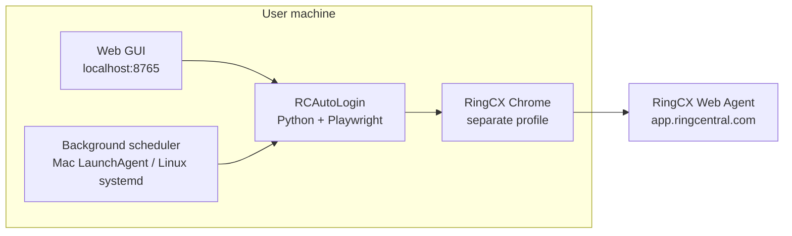
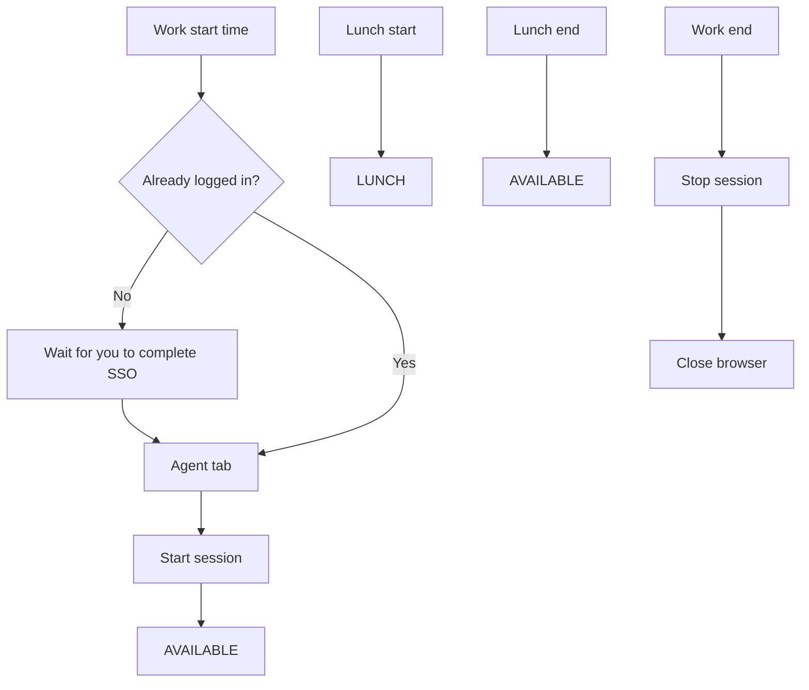

# RCAutoLogin — Team Demo Guide

**Tool name:** RCAutoLogin  
**Target:** RingCX web agent — `https://app.ringcentral.com/ring_cx/agent`  
**Purpose:** Automate daily agent login, lunch status, and logout on a schedule.

Use this document while presenting. Pair it with the PowerPoint (`RCAutoLogin_Team_Demo.pptx`) and a **live demo** at the end.

---

## 1. One-line pitch

> RCAutoLogin opens RingCX in a **separate Chrome window**, logs you in for the day, sets **Available / Lunch / Logout** on your schedule — so you don’t repeat the same clicks every shift.

---

## 2. Problem we’re solving

Agents on RingCX web typically do this **every working day**:

| When | Manual steps |
|------|----------------|
| Shift start | Open RingCX → sign in (SSO) → **Agent** tab → **Start session** → **AVAILABLE** |
| Lunch | Open presence menu → **LUNCH** |
| After lunch | Presence menu → **AVAILABLE** |
| Shift end | **Stop session** → close agent |

**Pain points:** easy to forget login/logout, repetitive clicks, and mixing RingCX with normal work Chrome.

---

## 3. What RCAutoLogin does (accurate)

| Scheduled time | Automated action |
|----------------|------------------|
| Work start | Open dedicated Chrome → RingCX Agent → **Start session** → **AVAILABLE** |
| Lunch start | Set status → **LUNCH** |
| Lunch end | Set status → **AVAILABLE** |
| Work end | **Stop session** → close browser |

**Control panel:** local web GUI in your browser (`http://127.0.0.1:8765/`) — set times, run actions now, start/stop background scheduler.

**Platforms:** macOS and Linux (with desktop + Chrome).

---

## 4. What it does NOT do (be clear in demo)

| Topic | Reality |
|-------|---------|
| SSO / OTP | **You** complete login the first time; the tool waits, then continues |
| Work Chrome | **Never** touched — uses its own profile (`chrome-rcx-profile`) |
| Cloud / server | Everything runs **locally** on the agent’s machine |
| IT API | This tool uses **browser automation**, not RingCentral API credentials |
| Headless / VM | Needs a **visible desktop** — Chrome must show on screen |

---

## 5. Architecture (high level)



**Components:**

| Piece | Role |
|-------|------|
| Web GUI | Set schedule, manual Login/Lunch/Logout, start auto job |
| Scheduler | Fires jobs at configured times (work days + timezone) |
| Playwright | Controls Chrome — clicks Agent tab, presence menu |
| Dedicated Chrome | Isolated profile; SSO session saved for reuse |

---

## 6. Daily flow (automation)



---

## 7. Web GUI (what to show in demo)

Launch:

```bash
.venv/bin/python rc_autologin_run.py
# or ./launch-gui.sh  (portable bundle)
```

| Section | Use |
|---------|-----|
| **Daily schedule** | Work start/end, lunch, timezone, work days → **Save schedule** |
| **Run now** | Login · Lunch · Back · Logout (test without waiting) |
| **Background automation** | Start/stop auto job · Pause · Mark leave today |
| **Activity log** | Shows what ran and any errors |

**Screenshot placeholders in PPT:** paste GUI, RingCX Chrome, and Agent/Available screens there.

---

## 8. First-time setup (for a new team member)

```bash
cd ~/Projects/Ring_Central_Automation   # or unzipped portable folder
bash setup.sh                           # once: venv + Playwright + Chrome
.venv/bin/python rc_autologin_run.py    # open GUI
```

1. Set shift times in GUI → **Save schedule**  
2. Click **Login** once → complete RingCentral SSO in the RingCX Chrome window  
3. Click **Start auto job** for daily automation  

**Requirements:** Python 3.11+, Google Chrome (or Chromium), desktop GUI, RingCX agent access.

---

## 9. Sharing with the team

Build a zip to send to others:

```bash
.venv/bin/python rc_autologin_run.py build-release
# → dist/RCAutoLogin-1.0.0-portable.zip
```

Recipient: unzip → `./install.sh` once → `./launch-gui.sh` or Mac `Launch RCAutoLogin.command`.

Do **not** share personal `.env` or `chrome-rcx-profile` (schedule + login cookies).

---

## 10. Suggested demo script (15–20 min)

| Min | What to do |
|-----|------------|
| 0–3 | Slides: problem → what tool does → what it doesn’t do |
| 3–5 | Slide: architecture + daily flow diagram |
| 5–8 | **Live:** open GUI, show schedule fields, save |
| 8–12 | **Live:** click **Login** → show RingCX Chrome → Agent → Available |
| 12–15 | **Live:** Run now Lunch / Back (if session active) |
| 15–17 | **Live:** Start auto job, show logs / status |
| 17–20 | Q&A — pause, leave day, Mac vs Linux, sharing zip |

---

## 11. FAQ (likely questions)

**Q: Does it enter my password?**  
A: No. You log in manually when prompted; the tool waits up to 10 minutes, then continues.

**Q: Will it affect my normal Chrome?**  
A: No. Separate profile and window.

**Q: What if I’m already Available?**  
A: It checks current state and skips redundant steps where possible.

**Q: Mac only?**  
A: Mac and Linux. Background service: LaunchAgent (Mac) or systemd (Linux).

**Q: What if RingCX UI changes?**  
A: Selectors in `rc_autologin/selectors.yaml` may need a small update.

---

## 12. Files & logs (for reference)

| Item | Location |
|------|----------|
| Entry point | `rc_autologin_run.py` |
| GUI | `rc_autologin/gui.py` + browser at `:8765` |
| Selectors | `rc_autologin/selectors.yaml` |
| Config | `.env` (times, timezone) |
| Scheduler logs | `logs/rc-autologin-scheduler.log` |
| GUI logs | `logs/gui-server.log` |

---

## 13. Presenter checklist

- [ ] PowerPoint: `RCAutoLogin_Team_Demo.pptx` (regenerate: `.venv/bin/python scripts/generate_rcautologin_presentation.py`)
- [ ] Screenshot slides filled or left blank for live paste later  
- [ ] GUI server running  
- [ ] RingCX test account ready  
- [ ] Schedule set to a demo time or use **Run now** buttons  
- [ ] Work Chrome closed or minimized so audience sees RingCX window clearly  
- [ ] Mention SSO step honestly before clicking Login  

---

*RCAutoLogin — RingCX web agent automation. Local tool for scheduled agent status management.*
